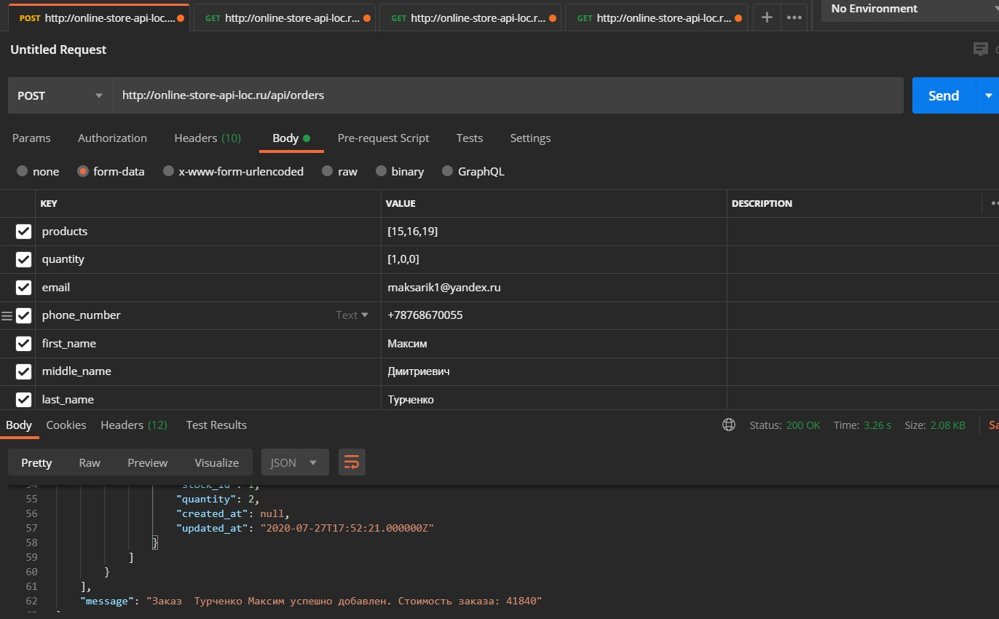
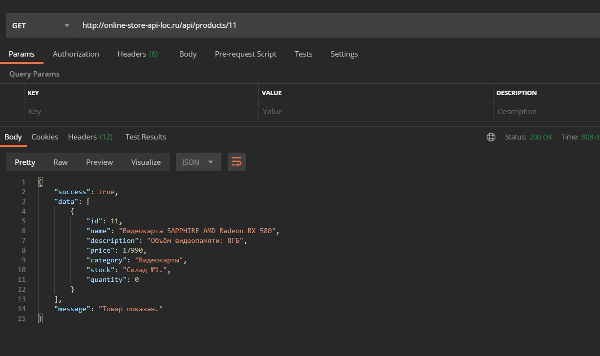
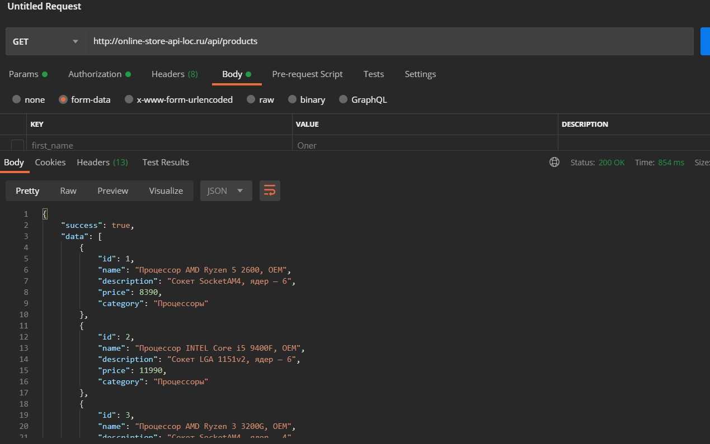
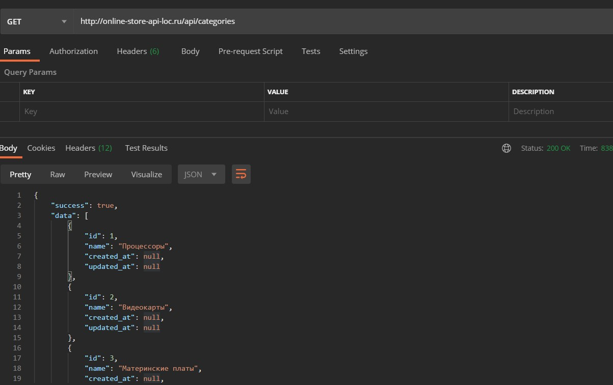
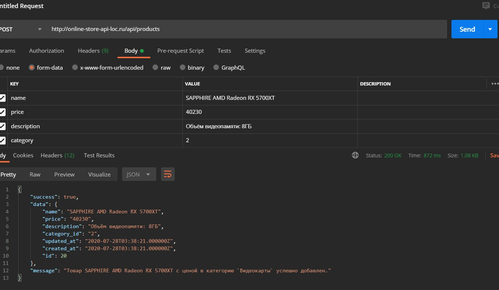
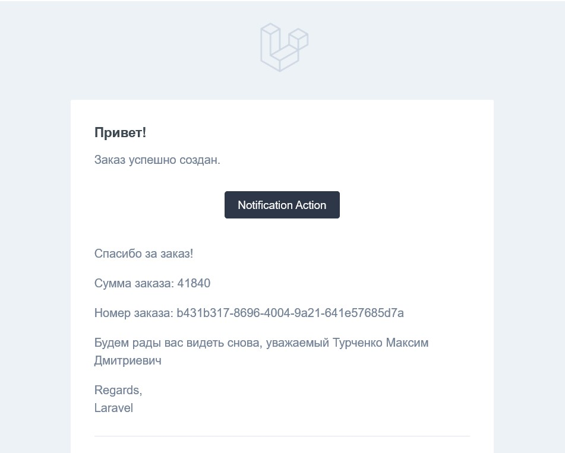
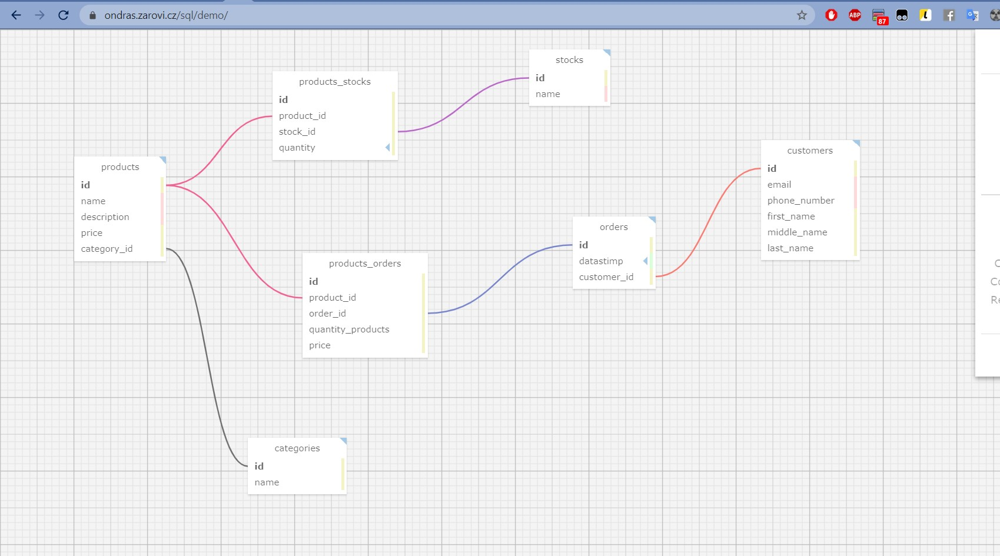

# online-store-api
 API for online store


 # Online-store-api
 
API for online store. API-приложение для интернет-магазина.
Реализован на Laravel.


## Приступая к работе

Установить laravel.
При запуске проекта, сделать миграцию с заполнением таблиц(seed), будут заполнены информацией о складе, категориями, товарами.
Для удобства работы с API удобно использовать программу Postman.
Для работы на клиенте ставим в заголовке(Headers): 

    Accept : application/json

### Описание возможностей

Заказать:

    POST http://{ваш-домен}/api/orders

Для заказа обязательны следущие поля : products, quantity, email, phone_number, first_name, middle_name, last_name.

    {
        "products": [15,16,19],
        "quantity": [2,1,1],
        "email": "maksarik1@yandex.ru",
        "phone_number": "+78768670055",
        "first_name": "Максим",
        "middle_name": "Дмитриевич",
        "last_name": "Турченко",
    } 
    Где указываем список продуктов и в quantity количество.

Пример:

        


Получить информацию о конкретном товаре:

    GET http://{ваш-домен}.ru/api/products/{product} 

, где  {product} - id товара

Пример:

       

В случае, если искомого товара нету, то будет получено сообщение об ошибке "товар не найден"
В данном случае отдаются кешированные ответы для оптимизации.

Получить информацию о всех товарах:

    GET http://{ваш-домен}.ru/api/products 

Пример:

       


Получить информацию о категориях на сайте:

    GET http://{ваш-домен}.ru/api/categories 

Пример:

    


Добавление товара в магазин:

    POST http://{ваш-домен}/api/products

Для заказа обязательны следущие поля : name, price, description, category(id категории). 

Пример:

       


После заказа клиенту будет отправлено письмо об успешном заказе
      

### Описание настроек

В файле config/managers.php можно добавить mail менеджеров, которым будут отправлены уведомления при заказе клиента.
В файле config/mail.php добавить админский mail, или в настройке окружения файл .env (MAIL_ADMIN=youradminmail@mail.ru)

    'admin_mail' => env('MAIL_ADMIN', 'admintestadress@example.com'),

Чтобы настроить отпраку писем в файле .env нужно указать почтовые данные сервера.
Пример:

    MAIL_MAILER=smtp
    MAIL_HOST=smtp.yandex.ru
    MAIL_PORT=587
    MAIL_USERNAME=super.practica@yandex.ru
    MAIL_PASSWORD=**************
    MAIL_ENCRYPTION=tls
    MAIL_FROM_ADDRESS=super.practica@yandex.ru
    MAIL_FROM_NAME="${APP_NAME}"

### БД проекта:
 
Картинка database_design.jpg  демонстрирует базу данных, связи проекта.
   
  
### Что не успел:
```
1)Отсылка уведомлений всем менеджерам. Причина: не успел
2)Отчеты администратору. Причина: не успел.
3)Реализовать в docker.Причина: пока не работал с docker.
4)Логирование действий сервера, также корректное логирование в docker-контейнере.
```   


